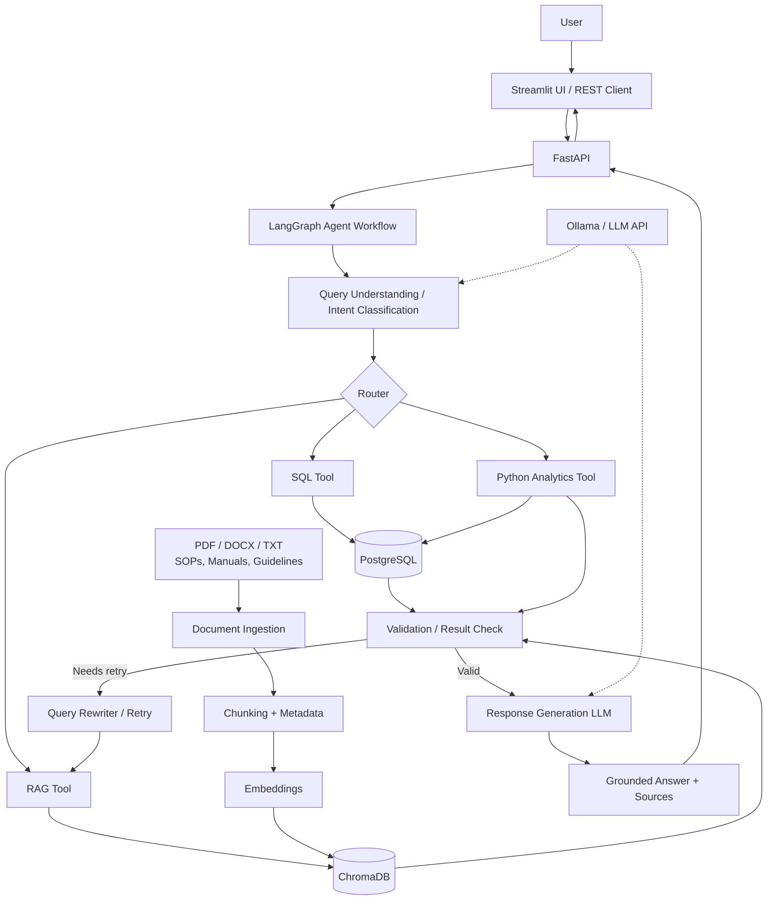

# Industrial AI Operations Copilot

An enterprise-style Generative AI proof-of-concept that combines **structured operational data, RAG, LLMs, LangChain, LangGraph, SQL and Python analytics** to answer industrial operations questions with grounded evidence.

> **Project status:** Data foundation completed. AI4I 2020 is the original source dataset. Equipment, production, maintenance, quality and energy datasets are synthetic datasets created for this portfolio project using AI4I operating characteristics and documented assumptions.

---

## 1. Project Objective

The goal is to build an AI operations assistant that can answer questions such as:

- Which equipment has the highest downtime?
- What was the production volume during a given period?
- Which failure modes resulted in the most maintenance events?
- Which machines have high energy consumption per unit?
- Is tool wear associated with quality degradation?
- Why did production decrease during a particular period?
- What does the operating procedure recommend when a machine enters a failure condition?

The assistant will use the appropriate source for each question instead of relying on the LLM's internal knowledge:

- **SQL** for structured operational data
- **Python/Pandas** for calculations and statistical analysis
- **RAG** for SOPs, manuals and other unstructured documents
- **LangGraph** for stateful routing, validation and agent workflow
- **LLM** for query understanding, reasoning and final response generation

---

## 2. Target Architecture



### Architecture flow

```text
User
  |
  v
FastAPI / Streamlit
  |
  v
LangGraph
  |
  +--> Query Understanding
  |
  +--> Router
         |
         +--> SQL Tool ----------> PostgreSQL
         |
         +--> Analytics Tool ----> Pandas / NumPy
         |
         +--> RAG Tool ----------> ChromaDB
                                      ^
                                      |
                         Documents -> Chunking -> Embeddings
         |
         v
     Validation
         |
         v
     LLM Response
         |
         v
   Answer + Sources
```

---

## 3. Technology Stack

| Layer | Technology | Purpose |
|---|---|---|
| Language | Python | Application and data-processing logic |
| LLM | Ollama initially | Local LLM inference |
| LLM framework | LangChain | LLM, prompts, loaders, retrievers and tools |
| Agent orchestration | LangGraph | Stateful workflow and conditional routing |
| RAG | LangChain + ChromaDB | Document retrieval and grounded generation |
| Embeddings | Sentence Transformers / Hugging Face | Semantic document representation |
| Structured database | PostgreSQL | Operational structured data |
| Analytics | Pandas / NumPy | Calculations and analysis |
| API | FastAPI | Backend API |
| UI | Streamlit | User-facing prototype |
| Testing | pytest | Unit and workflow testing |
| Containerization | Docker / Docker Compose | Reproducible deployment |
| Observability | Langfuse / LangSmith | Tracing and evaluation |
| Version control | Git / GitHub | Source control and portfolio development |

---

## 4. Current Data Architecture

```text
                         ai4i2020.csv
                       Original AI4I data
                              |
                              v
                     Synthetic data layer
                              |
        +---------------------+---------------------+
        |                     |                     |
        v                     v                     v
   equipment.csv       production.csv       maintenance.csv
        |                     |                     |
        |                     +----------+----------+
        |                                |
        |                     +----------+----------+
        |                     |                     |
        v                     v                     v
                  quality.csv            energy.csv
```

### Dataset descriptions

| Dataset | Type | Purpose |
|---|---|---|
| `ai4i2020.csv` | Original source | Predictive-maintenance machine and failure data |
| `equipment.csv` | Synthetic master | Equipment identity and static attributes |
| `production.csv` | Synthetic operational | Production batches, operating conditions and downtime |
| `maintenance.csv` | Synthetic event data | Corrective and preventive maintenance events |
| `quality.csv` | Synthetic operational | Quality inspection and defect indicators |
| `energy.csv` | Synthetic operational | Power, energy and specific-energy measurements |

### Important data assumption

The AI4I dataset does not contain physical equipment IDs or operational timestamps. This project therefore introduces synthetic `equipment_id` values and a synthetic operational timeline so that the data can support an enterprise-style relational model.

The synthetic datasets are **not claimed to be real plant data**. Their purpose is to provide a realistic, connected dataset for demonstrating SQL, analytics, RAG and agent workflows.

---

## 5. Repository Structure

```text
Operation_copilot/
│
├── app/
│   ├── data_generation/
│   │   └── generate_datasets.py
│   │
│   ├── api/
│   ├── agents/
│   ├── rag/
│   ├── tools/
│   ├── llm/
│   └── evaluation/
│
├── data/
│   ├── raw/
│   │   └── ai4i2020.csv
│   │
│   └── processed/
│       ├── equipment.csv
│       ├── production.csv
│       ├── maintenance.csv
│       ├── quality.csv
│       ├── energy.csv
│       └── data_dictionary.csv
│
├── documents/
│   ├── equipment_operating_sop.pdf
│   ├── maintenance_procedure.pdf
│   ├── safety_guidelines.pdf
│   ├── quality_control_procedure.pdf
│   └── energy_management_sop.pdf
│
├── notebooks/
├── tests/
├── .env.example
├── .gitignore
├── requirements.txt
└── README.md
```

Some directories are intentionally planned for later implementation.

---

## 6. RAG Architecture

The document knowledge layer will use:

```text
PDF / DOCX / TXT
       |
       v
Document Loader
       |
       v
Text Cleaning
       |
       v
Chunking
       |
       v
Metadata
       |
       v
Embedding Model
       |
       v
ChromaDB
       |
       v
Retriever
       |
       v
Relevant Context
       |
       v
LLM
       |
       v
Answer + Source References
```

The documents will contain information that is not present in the structured tables, such as operating procedures, maintenance instructions, safety limits and quality procedures.

---

## 7. Agent Workflow

LangGraph will orchestrate the future workflow:

```text
START
  |
  v
Query Understanding
  |
  v
Intent / Route Classification
  |
  +--------+---------+
  |        |         |
  v        v         v
 SQL     RAG     Analytics
  |        |         |
  +--------+---------+
           |
           v
       Validation
           |
      +----+----+
      |         |
    Valid     Invalid
      |         |
      |         v
      |    Query Rewrite
      |         |
      |       Retry
      |         |
      +---------+
           |
           v
    Response Generation
           |
           v
     Answer + Sources
           |
          END
```

A maximum retry/iteration limit will be implemented to prevent uncontrolled agent loops.

---

## 8. Example Future Questions

### Structured SQL

> Which machine had the highest downtime?

Expected route:

```text
Question -> SQL Tool -> PostgreSQL -> Result -> LLM
```

### Analytics

> Is tool wear associated with quality degradation?

Expected route:

```text
Question -> Python Analytics Tool -> Pandas -> Correlation/Analysis -> LLM
```

### RAG

> What should an operator do when the machine experiences a heat dissipation failure?

Expected route:

```text
Question -> RAG -> ChromaDB -> SOP context -> LLM -> Sources
```

### Multi-source agentic question

> Production dropped last month. What operational factors could explain it and what does the maintenance procedure recommend?

Expected route:

```text
Question
   |
   v
LangGraph
   |
   +--> SQL / Analytics -> production and maintenance evidence
   |
   +--> RAG -> maintenance procedure
   |
   v
LLM synthesis
   |
   v
Grounded response + sources
```

---

## 9. Development Roadmap

### Phase 1 — Data foundation

- [x] Add AI4I 2020 source dataset
- [x] Inspect source dataset
- [x] Generate synthetic equipment dataset
- [x] Generate synthetic production dataset
- [x] Generate synthetic maintenance dataset
- [x] Generate synthetic quality dataset
- [x] Generate synthetic energy dataset
- [x] Validate relationships between datasets

### Phase 2 — Structured data layer

- [ ] PostgreSQL database
- [ ] Database schema
- [ ] CSV loading pipeline
- [ ] SQL queries
- [ ] Data validation tests

### Phase 3 — Document knowledge layer

- [ ] Create controlled industrial SOP documents
- [ ] Document loaders
- [ ] Text chunking
- [ ] Metadata
- [ ] Embeddings
- [ ] ChromaDB
- [ ] Retriever

### Phase 4 — Basic RAG

- [ ] Basic retrieval pipeline
- [ ] Prompt template
- [ ] Grounded answer generation
- [ ] Source attribution
- [ ] Retrieval testing

### Phase 5 — LangChain

- [ ] LangChain document pipeline
- [ ] LangChain retriever
- [ ] Prompt management
- [ ] Tool interfaces

### Phase 6 — Agent workflow

- [ ] SQL tool
- [ ] Python analytics tool
- [ ] RAG tool
- [ ] LangGraph state
- [ ] Query routing
- [ ] Validation
- [ ] Retry/query rewriting

### Phase 7 — Evaluation

- [ ] RAG evaluation dataset
- [ ] Retrieval metrics
- [ ] Faithfulness
- [ ] Answer relevance
- [ ] Agent routing accuracy
- [ ] Tool execution success
- [ ] Latency tracking

### Phase 8 — Application

- [ ] FastAPI
- [ ] Streamlit UI
- [ ] Error handling
- [ ] Security/guardrails
- [ ] Docker
- [ ] Observability
- [ ] Final documentation/demo

---

## 10. GitHub Development Strategy

The project is intentionally developed incrementally. Each meaningful stage should be committed separately so that the repository shows the evolution of the system.

Example commit sequence:

```text
01 Initialize project structure
02 Add AI4I source dataset
03 Create synthetic equipment dataset
04 Create synthetic production dataset
05 Create synthetic maintenance dataset
06 Create synthetic quality dataset
07 Create synthetic energy dataset
08 Add PostgreSQL schema
09 Load operational data into PostgreSQL
10 Add industrial SOP documents
11 Implement document ingestion
12 Implement document chunking
13 Add embeddings and ChromaDB
14 Implement basic RAG
15 Integrate LangChain
16 Add SQL tool
17 Add Python analytics tool
18 Implement LangGraph workflow
19 Add agentic RAG and query rewriting
20 Add RAG evaluation
21 Add agent evaluation
22 Add FastAPI
23 Add Streamlit UI
24 Add security and guardrails
25 Add Docker
26 Add observability
27 Finalize documentation and demo
```

---

## 11. Current Milestone

**Milestone: Synthetic data foundation completed.**

The current repository contains the original AI4I source dataset and connected synthetic datasets that will later be loaded into PostgreSQL.

The next milestone is the **structured data layer**:

```text
CSV files
   |
   v
PostgreSQL schema
   |
   v
Data loading
   |
   v
SQL validation
   |
   v
SQL Tool
```

---

## 12. Data and Portfolio Disclaimer

This is a portfolio/learning project. The AI4I 2020 dataset is used as the original predictive-maintenance source. The additional operational datasets are synthetic and should not be interpreted as real industrial plant measurements, company data, or historical production records.

No confidential company or client data should be committed to this repository.
